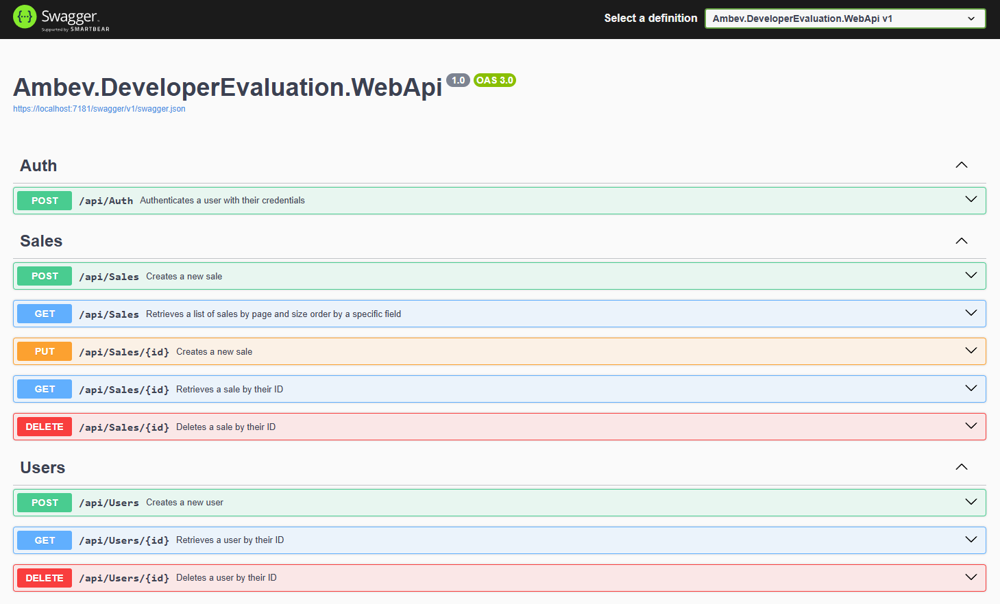

# Developer Evaluation Project

## Descrição do Projeto

Trata-se de uma interface de programação de aplicações (API) que gerencia registros de vendas.
Ela permite que os usuários realizem operações de CRUD (Create, Read, Update, Delete) sobre os registros de vendas, fornecendo informações sobre cada venda, como: número da venda, data, cliente, valor total, filial, produtos, quantidades, preços unitários, descontos, total por item e status de cancelamento.

### Arquitetura e Escopo do Projeto

O desenvolvimento desta API segue o princípio de **Domain-Driven Design (DDD)**, que é uma abordagem de design de software focada no domínio específico da aplicação e nas suas regras de negócio. A utilização de DDD permite um design mais modular e alinhado às necessidades de negócio, facilitando a manutenção e evolução do sistema.

### Sobre a API

Esta API foi desenvolvida como um **protótipo** e, portanto, seu foco está exclusivamente no domínio das regras de desconto. A API implementa operações de CRUD (Create, Read, Update, Delete) para gerenciar registros de vendas, incluindo o cálculo dos descontos conforme as regras definidas.

### Escopo do Protótipo

Para manter a simplicidade e o foco, **este protótipo não inclui os cadastros e funcionalidades relacionadas a outros domínios**, tais como:

- **Usuário, Acesso e Autenticação:** Gestão de usuários e controle de acesso não foram implementados, pois pertencem a um domínio diferente.
- **Cliente, Filial e Produtos:** A gestão de clientes, filiais e produtos também foi abstraída, uma vez que essas informações pertencem a outro domínio.

Essas abstrações foram feitas para que pudéssemos concentrar nossos esforços na implementação das regras de negócio específicas para o cálculo de descontos baseados na quantidade de itens vendidos, que é o objetivo principal deste protótipo.

### Regras de Negócio

1. **Faixas de Desconto por Quantidade:**
   - Compras acima de 4 itens idênticos recebem um desconto de 10%.
   - Compras entre 10 e 20 itens idênticos recebem um desconto de 20%.

2. **Restrições:**
   - Limite máximo: Não é possível vender mais de 20 itens idênticos.
   - Nenhum desconto é permitido para quantidades abaixo de 4 itens.

Estas regras de negócio definem faixas de desconto baseadas na quantidade de itens comprados e estabelecem limitações específicas para as vendas. Veja abaixo os detalhes:

1. **Faixas de Desconto:**
   - **4 ou mais itens:** Quando um cliente compra 4 ou mais itens idênticos, ele recebe um desconto de 10% sobre o preço total desses itens.
   - **Entre 10 e 20 itens:** Quando um cliente compra entre 10 e 20 itens idênticos, ele recebe um desconto de 20% sobre o preço total desses itens.

2. **Restrições:**
   - **Limite Máximo de Itens:** Não é permitido vender mais de 20 itens idênticos em uma única transação. Se um cliente tentar comprar mais de 20 itens iguais, a venda não pode ser processada.
   - **Sem Desconto para Quantidades Menores:** Para compras com menos de 4 itens idênticos, não há aplicação de desconto. O cliente paga o preço normal desses itens.

Estas regras são importantes para gerenciar os descontos de forma justa e garantir que as vendas estejam dentro dos limites estabelecidos pela política da empresa.

### Considerações sobre Produtos na API

Cada item de produto na API é tratado como único, ou seja, o mesmo produto não se repete dentro da lista de itens de uma venda. O protótipo foi desenvolvido com a premissa de que o consumidor desta API irá agrupar todos os produtos iguais em um único item, somando o campo de quantidade.

Isso significa que, ao utilizar a API, espera-se que o cliente forneça os dados de uma venda de maneira consolidada, agrupando produtos idênticos em uma única entrada e somando suas quantidades. 

#### Exemplo Prático

Se uma venda contém 5 unidades do "Produto A" e 3 unidades do "Produto A", a API deve receber esses dados agrupados em uma única entrada com uma quantidade total de 8 unidades do "Produto A".

**Exemplo de Entrada na API:**
```json
{
  "saleNumber": "12345",
  "saleDate": "2025-02-07T15:30:00",
  "customer": "João Silva",
  "branch": "Filial Central",
  "products": [
    {
      "product": "Produto A",
      "quantity": 8,
      "unitPrice": 20.00,
    }
  ],
  "isCancelled": 2
}
```

Neste exemplo, "Produto A" aparece uma única vez na lista de itens, com a quantidade total combinada. Isso facilita o processamento das regras de negócio para o cálculo de descontos e mantém a consistência dos dados.


### Campo `isCancelled` e Enum `SaleStatus`

O campo `isCancelled` é usado para indicar o status de uma venda e é baseado em um enumerador (enum) chamado `SaleStatus`. Este enum define os possíveis valores para o status de uma venda. Aqui estão os valores do enum `SaleStatus`:

- **0: Unknown** - O status da venda é desconhecido.
- **1: Cancelled** - A venda foi cancelada.
- **2: NotCancelled** - A venda não foi cancelada.

Em todos os exemplos citados aqui neste manual o campo `isCancelled` está definido como `2`, indicando que a venda não foi cancelada.
O valor **0: Unknown** não é aceito nas solicitações.


## Tecnologias Utilizadas


### Backend
- **.NET 8.0**: Uma plataforma de desenvolvedor gratuita, multiplataforma e de código aberto para a criação de vários tipos de aplicações.
  - [GitHub - .NET](https://github.com/dotnet/core)
- **C#**: Uma linguagem de programação moderna orientada a objetos desenvolvida pela Microsoft.
  - [GitHub - C#](https://github.com/dotnet/csharplang)
- **Mediator**: Um padrão de design comportamental que ajuda a reduzir dependências caóticas entre objetos. Ele permite o acoplamento solto ao encapsular a interação dos objetos.
  - [GitHub - MediatR](https://github.com/jbogard/MediatR)
- **Automapper**: Um mapeador de objeto-objeto baseado em convenções que simplifica o processo de mapear um objeto para outro.
  - [GitHub - AutoMapper](https://github.com/AutoMapper/AutoMapper)
- **Rebus**: Uma implementação de service bus enxuta para .NET, fornecendo uma maneira simples e flexível de fazer mensagens e enfileiramento em aplicações .NET.
  - [GitHub - Rebus](https://github.com/rebus-org/Rebus)

### Testing
- **xUnit**: Uma ferramenta de teste unitário gratuita, de código aberto e focada na comunidade para o .NET Framework.
  - [GitHub - xUnit](https://github.com/xunit/xunit)
- **Faker**: Uma biblioteca para gerar dados falsos para testes, permitindo cenários de teste mais realistas e diversificados.
  - [GitHub - Bogus](https://github.com/bchavez/Bogus)
- **NSubstitute**: Uma biblioteca de mock amigável para .NET, usada para criar substitutos de testes em testes unitários.
  - [GitHub - NSubstitute](https://github.com/nsubstitute/NSubstitute)

### Database
- **PostgreSQL**: Um sistema de banco de dados objeto-relacional poderoso e de código aberto.
  - [GitHub - PostgreSQL](https://github.com/postgres/postgres)
- **MongoDB**: Um banco de dados distribuído baseado em documentos de uso geral.
  - [GitHub - MongoDB](https://github.com/mongodb/mongo)
- **EF Core**: Entity Framework Core, uma versão leve, extensível e multiplataforma do Entity Framework, usada para acesso a dados e mapeamento objeto-relacional.
  - [GitHub - EF Core](https://github.com/dotnet/efcore)


## Guia de Instalação e Execução
Passo a passo para configurar e executar o projeto.

#### Pré-requisitos
- Windows 10/11 64 bits instalado
- Acesso à Internet e ao site do GitHub

### Passo a Passo para instalar as ferramentas

**Instalar Microsoft Visual Studio Community 2022**
- [Baixe o Visual Studio Community 2022](https://visualstudio.microsoft.com/pt-br/vs/community/)

**Instalar Docker Desktop para Windows**
- [Guia de Instalação do Docker Desktop no Windows](https://docs.docker.com/desktop/setup/install/windows-install/)


### Passo a Passo para Baixar, Descompactar e Abrir o Projeto

1. **Acessar o Repositório no GitHub**
   - Vá para o repositório do projeto no GitHub usando seu navegador web em: https://github.com/MssDev2/Ambev.DeveloperEvaluation/tree/master

2. **Baixar o ZIP do Projeto**
   - Na página do repositório, clique no botão "Code".
   - Selecione a opção "Download ZIP" no menu suspenso.
   - O arquivo ZIP do projeto será baixado para o seu computador.

    

3. **Descompactar o ZIP do Projeto**
   - Navegue até a pasta onde o arquivo ZIP foi baixado.
   - Clique com o botão direito do mouse no arquivo ZIP e selecione "Extrair tudo..." ou uma opção similar.
   - Escolha o local (exemplo: C:\Projetos\Ambev) onde deseja descompactar os arquivos e clique em "Extrair".

4. **Abrir o Projeto no Visual Studio**
   - Abra o **Microsoft Visual Studio Community 2022**.
   - No Visual Studio, clique em "Abrir um projeto ou solução" na tela inicial.
   - Navegue até a pasta onde você descompactou os arquivos do projeto.
   - Selecione o arquivo de solução do projeto (`.sln`) e clique em "Abrir".

### Passo a Passo para Configurar a Conexão com o Banco de Dados

1. **Abrir o Arquivo docker-compose.yml**
   - No "Gerenciador de Soluções" (Solution Explorer), encontre o projeto `docker-compose`.
   - Clique duas vezes no arquivo `docker-compose.yml` para abri-lo.

2. **Verificar Configuração do Serviço PostgreSQL**
   - No arquivo `docker-compose.yml`, verifique se há uma seção para o serviço PostgreSQL.
   - Já está configurado com os dados de conexão corretos, mas agora você já sabe onde mudar caso seja necessário.
   
   - Deve se parecer com isso:
     ```yaml
     services:
        ambev.developerevaluation.database:
        container_name: ambev_developer_evaluation_database
        image: postgres:13

        environment:
          POSTGRES_DB: developer_evaluation
          POSTGRES_USER: developer
          POSTGRES_PASSWORD: sua_senha
        ports:
          - "5432:5432"
        restart: unless-stopped
     ```

3. **Executar o Docker Compose**
   - No "Gerenciador de Soluções" (Solution Explorer), clique com o botão direito do mouse no projeto `docker-compose`.
   - Selecione "Compose Up" no menu suspenso.
   - Isso iniciará os serviços definidos no arquivo `docker-compose.yml`, incluindo o PostgreSQL.
   - Pode demorar um pouco, pois serão baixados e instalados todos os pacotes necessários dentro do container.

4. **Configurar a String de Conexão no Projeto**
   - No Visual Studio, encontre o arquivo `appsettings.json` no seu projeto principal (não o projeto `docker-compose`).
   - Abra o arquivo `appsettings.json` e configure a string de conexão com o PostgreSQL.
   - Já está configurado com os dados de conexão corretos, mas agora você já sabe onde mudar caso seja necessário.
   - Os dados de conexão deste arquivo devem estar coerentes com os dados do arquivo `docker-compose.yml` mencionado antes.
- 
   - Deve se parecer com isso:
     ```json
     {
       "ConnectionStrings": {
         "DefaultConnection": "Server=localhost;Database=developer_evaluation;User Id=developer;Password=sua_senha;TrustServerCertificate=True"
       }
     }
     ```

### Passo a Passo para Instalar e Usar o Entity Framework Core (EF Core)

1. **Instalar a Ferramenta dotnet-ef**
   - Abra o terminal (Prompt de Comando, PowerShell ou terminal integrado do Visual Studio).
   - Execute o seguinte comando para instalar a ferramenta `dotnet-ef` globalmente:
     ```bash
     dotnet tool install --global dotnet-ef
     ```

2. **Navegar até a Pasta do Projeto**
   - Navegue até a pasta do projeto onde está a aplicação WebApi. 
   - No seu caso, a pasta é `.\src\Ambev.DeveloperEvaluation.WebApi`. Execute o comando:
     ```bash
     cd .\src\Ambev.DeveloperEvaluation.WebApi
     ```

3. **Conferir as Migrações Existentes**
   - Para listar as migrações existentes, execute o seguinte comando:
     ```bash
     dotnet ef migrations list
     ```
   - Vai mostrar a seguinte lista de pendências:
		- 20241014011203_InitialMigrations (Pending)
		- 20250202020411_InitialFix (Pending)
		- 20250204003118_CreateSales (Pending)

4. **Criar e Atualizar as Tabelas do Banco de Dados**
   - Para criar e atualizar as tabelas do banco de dados com base nas migrações, execute o seguinte comando:
     ```bash
     dotnet ef database update
     ```

> Resumo dos Comandos

```bash
dotnet tool install --global dotnet-ef
cd .\src\Ambev.DeveloperEvaluation.WebApi
dotnet ef migrations list
dotnet ef database update
```


### Passo a Passo para Executar o Projeto e Abrir o Swagger

1. **Executar o Projeto**
   - No Visual Studio, pressione `F5` para compilar e executar o projeto.
   - O projeto será iniciado e a aplicação estará rodando localmente.

2. **Abrir o Swagger**
   - Após iniciar o projeto, abra o navegador da web e acesse a seguinte URL: `https://localhost:7181/swagger/index.htmlr` (o número da porta pode variar, então ajuste conforme necessário).
   - Isso abrirá a interface do Swagger, que é uma ferramenta para documentar e testar APIs.

### Como Funciona o Swagger

O Swagger é uma ferramenta que facilita a documentação e o teste de APIs. Ele gera automaticamente uma interface de usuário interativa baseada nas anotações do código da API, permitindo que os desenvolvedores visualizem e testem os endpoints disponíveis.




#### Exemplo de Uso do Swagger para a API `CreateSale`

1. **Navegar até o Endpoint `CreateSale`**
   - Na interface do Swagger, você verá uma lista de endpoints disponíveis organizados por controlador.
   - Encontre o endpoint `POST /api/sales` (ou similar) que corresponde à criação de uma venda (`CreateSale`).

2. **Visualizar a Documentação do Endpoint**
   - Clique no endpoint `POST /api/sales` para expandir a documentação.
   - Você verá detalhes sobre o endpoint, como a URL, o método HTTP, os parâmetros esperados e a descrição do endpoint.

3. **Testar o Endpoint `CreateSale`**
   - Clique no botão "Try it out" (ou "Experimente") para habilitar o teste do endpoint.
   - Um formulário aparecerá permitindo que você insira os dados necessários para criar uma venda.
   - Preencha o formulário com os dados da venda. Por exemplo:
     ```json
     {
      "saleNumber": 111,
      "saleDate": "2025-02-04T04:14:24.496Z",
      "customer": "Fulano",
      "branch": "Filial2",
      "isCancelled": 2,
      "products": [
        {
          "product": "Agua Mineral 100ml",
          "quantity": 1,
          "unitPrice": 15.55
        },
        {
          "product": "Bolacha 200g",
          "quantity": 10,
          "unitPrice": 5
        }    
      ]
     }
     ```

4. **Enviar a Requisição**
   - Após preencher os dados, clique no botão "Execute" para enviar a requisição para o endpoint.
   - Você verá a resposta da API abaixo do formulário, incluindo o código de status HTTP e os dados da resposta.

Seguindo esses passos, você conseguirá executar o projeto, abrir o Swagger e testar a API `CreateSale` usando a interface interativa do Swagger.

### Operações CRUD na API

- **CreateSale**: Cria um novo registro de venda.
- **GetSale (pelo ID)**: Retorna os detalhes de uma venda específica com base no ID fornecido.
- **GetSales (lista paginada e ordenada)**: Retorna uma lista de vendas com suporte para paginação e ordenação.
- **UpdateSale**: Atualiza os detalhes de uma venda existente com base no ID fornecido.
- **DeleteSale**: Remove um registro de venda existente com base no ID fornecido.

### Considerações Finais

Com este passo a passo, você terá condições de entender como instalar, executar e testar a API. 

Caso encontre algum problema ou tenha dúvidas durante o processo, sinta-se à vontade para entrar em contato.

Se precisar de suporte adicional ou quiser reportar um problema, você pode criar uma **issue** no GitHub. Para isso, siga os passos abaixo:
1. Acesse o repositório do projeto no GitHub.
2. Clique na aba "Issues".
3. Clique no botão "New issue" para criar uma nova issue.
4. Descreva o problema ou a dúvida detalhadamente e clique em "Submit new issue".

Estamos aqui para ajudar e garantir que você tenha a melhor experiência possível com o nosso projeto.

Obrigado por sua atenção.
