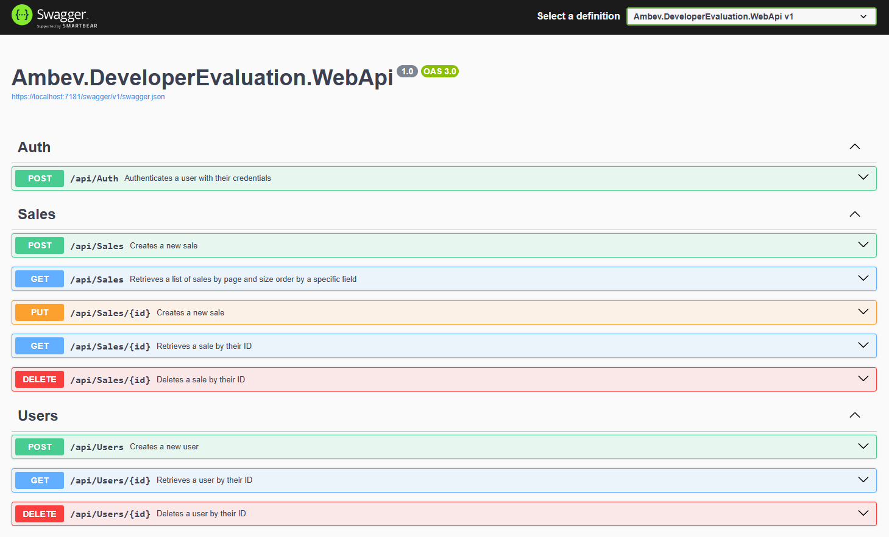

# Developer Evaluation Project

## Project Description

This is an Application Programming Interface (API) that manages sales records.
It allows users to perform CRUD (Create, Read, Update, Delete) operations on sales records, providing information about each sale, such as sale number, date, customer, total amount, branch, products, quantities, unit prices, discounts, total per item, and cancellation status.

### Architecture and Project Scope

The development of this API follows the principle of **Domain-Driven Design (DDD)**, which is a software design approach focused on the specific domain of the application and its business rules. Using DDD allows for a more modular design aligned with business needs, facilitating system maintenance and evolution.

### About the API

This API was developed as a **prototype** and, therefore, its focus is exclusively on the domain of discount rules. The API implements CRUD (Create, Read, Update, Delete) operations to manage sales records, including calculating discounts according to defined rules.

### Prototype Scope

To keep it simple and focused, **this prototype does not include registrations and functionalities related to other domains**, such as:

- **User, Access, and Authentication:** User management and access control were not implemented as they belong to a different domain.
- **Customer, Branch, and Products:** Customer, branch, and product management were also abstracted since this information belongs to another domain.

These abstractions were made so that we could focus our efforts on implementing the specific business rules for calculating discounts based on the number of items sold, which is the main objective of this prototype.

### Business Rules

1. **Discount Tiers by Quantity:**
   - Purchases of more than 4 identical items receive a 10% discount.
   - Purchases of 10 to 20 identical items receive a 20% discount.

2. **Restrictions:**
   - Maximum limit: It is not possible to sell more than 20 identical items.
   - No discount is allowed for quantities below 4 items.

These business rules define discount tiers based on the number of items purchased and set specific sales limitations. See the details below:

1. **Discount Tiers:**
   - **4 or more items:** When a customer buys 4 or more identical items, they receive a 10% discount on the total price of those items.
   - **Between 10 and 20 items:** When a customer buys between 10 and 20 identical items, they receive a 20% discount on the total price of those items.

2. **Restrictions:**
   - **Maximum Item Limit:** It is not allowed to sell more than 20 identical items in a single transaction. If a customer tries to buy more than 20 identical items, the sale cannot be processed.
   - **No Discount for Smaller Quantities:** For purchases of less than 4 identical items, no discount is applied. The customer pays the regular price for these items.

These rules are important to manage discounts fairly and ensure that sales are within the limits set by the company's policy.

### Considerations for Products in the API

Each product item in the API is treated as unique, meaning the same product does not repeat within the list of items in a sale. The prototype was developed under the premise that the consumer of this API will group all identical products into a single item, summing the quantity field.

This means that when using the API, it is expected that the client will provide the sale data in a consolidated manner, grouping identical products into a single entry and summing their quantities.

#### Practical Example

If a sale contains 5 units of "Product A" and 3 units of "Product A", the API should receive these grouped data in a single entry with a total quantity of 8 units of "Product A".

**Example of API Entry:**
```json
{
  "saleNumber": "12345",
  "saleDate": "2025-02-07T15:30:00",
  "customer": "John Smith",
  "branch": "Central Branch",
  "products": [
    {
      "product": "Product A",
      "quantity": 8,
      "unitPrice": 20.00,
    }
  ],
  "isCancelled": 2
}
```

In this example, "Product A" appears only once in the item list, with the combined total quantity. This simplifies the processing of business rules for discount calculation and maintains data consistency.

### `isCancelled` Field and `SaleStatus` Enum

The `isCancelled` field is used to indicate the status of a sale and is based on an enumerator (enum) called `SaleStatus`. This enum defines the possible values for the sale status. Here are the enum `SaleStatus` values:

- **0: Unknown** - The sale status is unknown.
- **1: Cancelled** - The sale was canceled.
- **2: NotCancelled** - The sale was not canceled.

In all examples cited here in this manual, the `isCancelled` field is set to `2`, indicating that the sale was not canceled.
The value **0: Unknown** is not accepted in requests.

## Technologies Used

### Backend
- **.NET 8.0**: A free, cross-platform, open-source developer platform for building various types of applications.
  - [GitHub - .NET](https://github.com/dotnet/core)
- **C#**: A modern, object-oriented programming language developed by Microsoft.
  - [GitHub - C#](https://github.com/dotnet/csharplang)
- **Mediator**: A behavioral design pattern that helps reduce chaotic dependencies between objects. It enables loose coupling by encapsulating the interaction of objects.
  - [GitHub - MediatR](https://github.com/jbogard/MediatR)
- **Automapper**: A convention-based object-object mapper that simplifies the process of mapping one object to another.
  - [GitHub - AutoMapper](https://github.com/AutoMapper/AutoMapper)
- **Rebus**: A lean service bus implementation for .NET, providing a simple and flexible way to do messaging and queuing in .NET applications.
  - [GitHub - Rebus](https://github.com/rebus-org/Rebus)

### Testing
- **xUnit**: A free, open-source, community-focused unit testing tool for the .NET Framework.
  - [GitHub - xUnit](https://github.com/xunit/xunit)
- **Faker**: A library for generating fake data for tests, allowing for more realistic and diverse testing scenarios.
  - [GitHub - Bogus](https://github.com/bchavez/Bogus)
- **NSubstitute**: A friendly mocking library for .NET, used for creating test substitutes in unit tests.
  - [GitHub - NSubstitute](https://github.com/nsubstitute/NSubstitute)

### Database
- **PostgreSQL**: A powerful, open-source object-relational database system.
  - [GitHub - PostgreSQL](https://github.com/postgres/postgres)
- **MongoDB**: A general-purpose, document-based, distributed database built for modern application developers.
  - [GitHub - MongoDB](https://github.com/mongodb/mongo)
- **EF Core**: Entity Framework Core, a lightweight, extensible, cross-platform version of Entity Framework, used for data access and object-relational mapping.
  - [GitHub - EF Core](https://github.com/dotnet/efcore)

## Installation and Execution Guide

Step-by-step instructions for setting up and running the project.

#### Prerequisites
- Installed Windows 10/11 64-bits
- Internet access and GitHub site access

### Step-by-Step Instructions for Installing the Tools

**Install Microsoft Visual Studio Community 2022**
- [Download Visual Studio Community 2022](https://visualstudio.microsoft.com/vs/community/)

**Install Docker Desktop for Windows**
- [Docker Desktop Installation Guide for Windows](https://docs.docker.com/desktop/install/windows-install/)

### Step-by-Step Instructions for Downloading, Unzipping, and Opening the Project

1. **Access the Repository on GitHub**
   - Go to the project's repository on GitHub using your web browser at: https://github.com/MssDev2/Ambev.DeveloperEvaluation/tree/master

2. **Download the Project ZIP**
   - On the repository page, click the "Code" button.
   - Select the "Download ZIP" option from the dropdown menu.
   - The project's ZIP file will be downloaded to your computer.

    

3. **Unzip the Project ZIP**
   - Navigate to the folder where the ZIP file was downloaded.
   - Right-click on the ZIP file and select "Extract All..." or a similar option.
   - Choose the location (e.g., C:\Projects\Ambev) where you want to unzip the files and click "Extract".

4. **Open the Project in Visual Studio**
   - Open **Microsoft Visual Studio Community 2022**.
   - In Visual Studio, click "Open a project or solution" on the start screen.
   - Navigate to the folder where you unzipped the project files.
   - Select the project solution file (`.sln`) and click "Open".

### Step-by-Step Instructions for Configuring the Database Connection

1. **Open the `docker-compose.yml` File**
   - In the "Solution Explorer", find the `docker-compose` project.
   - Double-click the `docker-compose.yml` file to open it.

2. **Check PostgreSQL Service Configuration**
   - In the `docker-compose.yml` file, ensure there is a section for the PostgreSQL service.
   - It's already configured with the correct connection details, but now you know where to change it if necessary.

   The configuration should look like this:
   ```yaml
   services:
     ambev.developerevaluation.database:
       container_name: ambev_developer_evaluation_database
       image: postgres:13
       environment:
         POSTGRES_DB: developer_evaluation
         POSTGRES_USER: developer
         POSTGRES_PASSWORD: your_password
       ports:
         - "5432:5432"
       restart: unless-stopped
   ```

3. **Run Docker Compose**
   - In the "Solution Explorer", right-click on the `docker-compose` project.
   - Select "Compose Up" from the dropdown menu.
   - This will start the services defined in the `docker-compose.yml` file, including PostgreSQL.
   - It may take some time as all necessary packages are downloaded and installed inside the container.

4. **Configure the Connection String in the Project**
   - In Visual Studio, locate the `appsettings.json` file in your main project (not the `docker-compose` project).
   - Open the `appsettings.json` file and configure the connection string for PostgreSQL.
   - It's already configured with the correct connection details, but now you know where to change it if necessary.
   - The connection details in this file should match the details in the `docker-compose.yml` file mentioned earlier.

   The configuration should look like this:
   ```json
   {
     "ConnectionStrings": {
       "DefaultConnection": "Server=localhost;Database=developer_evaluation;User Id=developer;Password=your_password;TrustServerCertificate=True"
     }
   }
   ```

### Step-by-Step Instructions for Installing and Using Entity Framework Core (EF Core)

1. **Install the `dotnet-ef` Tool**
   - Open the terminal (Command Prompt, PowerShell, or Visual Studio integrated terminal).
   - Run the following command to install the `dotnet-ef` tool globally:
     ```bash
     dotnet tool install --global dotnet-ef
     ```

2. **Navigate to the Project Folder**
   - Navigate to the project folder where the WebApi application is located.
   - In your case, the folder is `.\src\Ambev.DeveloperEvaluation.WebApi`. Run the command:
     ```bash
     cd .\src\Ambev.DeveloperEvaluation.WebApi
     ```

3. **Check Existing Migrations**
   - To list existing migrations, run the following command:
     ```bash
     dotnet ef migrations list
     ```
   - This will show the following list of pending migrations:
     - 20241014011203_InitialMigrations (Pending)
     - 20250202020411_InitialFix (Pending)
     - 20250204003118_CreateSales (Pending)

4. **Create and Update Database Tables**
   - To create and update database tables based on migrations, run the following command:
     ```bash
     dotnet ef database update
     ```

> Summary of Commands

```bash
dotnet tool install --global dotnet-ef
cd .\src\Ambev.DeveloperEvaluation.WebApi
dotnet ef migrations list
dotnet ef database update
```

### Step-by-Step Instructions for Running the Project and Opening Swagger

1. **Run the Project**
   - In Visual Studio, press `F5` to build and run the project.
   - The project will start, and the application will be running locally.

2. **Open Swagger**
   - After starting the project, open your web browser and navigate to the following URL: `https://localhost:7181/swagger/index.html` (the port number may vary, so adjust as needed).
   - This will open the Swagger interface, which is a tool for documenting and testing APIs.

### How Swagger Works

Swagger is a tool that simplifies API documentation and testing. It automatically generates an interactive user interface based on the API code annotations, allowing developers to view and test available endpoints.



### CRUD Operations in the API

In the Swagger interface, you'll see a list of available endpoints organized by controller.
- **CreateSale**: Creates a new sales record.
- **GetSale (by ID)**: Returns details of a specific sale based on the provided ID.
- **GetSales (paginated and sorted list)**: Returns a list of sales with pagination and sorting support.
- **UpdateSale**: Updates the details of an existing sale based on the provided ID.
- **DeleteSale**: Removes an existing sales record based on the provided ID.

#### Example of Using Swagger for the `CreateSale` API

1. **Navigate to the `CreateSale` Endpoint**
   - Find the `POST /api/sales` endpoint (or similar) that corresponds to creating a sale (`CreateSale`).

2. **View Endpoint Documentation**
   - Click on the `POST /api/sales` endpoint to expand the documentation.
   - You'll see details about the endpoint, such as the URL, HTTP method, expected parameters, and endpoint description.

3. **Test the `CreateSale` Endpoint**
   - Click the "Try it out" button to enable endpoint testing.
   - A form will appear allowing you to enter the required data to create a sale.
   - Fill out the form with the sale data. For example:
     ```json
     {
       "saleNumber": 111,
       "saleDate": "2025-02-04T04:14:24.496Z",
       "customer": "Fulano",
       "branch": "Branch2",
       "isCancelled": 2,
       "products": [
         {
           "product": "Mineral Water 100ml",
           "quantity": 1,
           "unitPrice": 15.55
         },
         {
           "product": "Cookie 200g",
           "quantity": 10,
           "unitPrice": 5
         }
       ]
     }
     ```

4. **Submit the Request**
   - After filling in the data, click the "Execute" button to send the request to the endpoint.
   - You'll see the API response below the form, including the HTTP status code and response data.

#### Example of Using Swagger for the `GetSaleList` API

1. **Navigate to the `GetSaleList` Endpoint**
   - Find the `GET /api/sales` endpoint (or similar) that corresponds to retrieves a list of sales by page and size order by a specific fields, and filters by specific fields (`GetSaleList`).

2. **View Endpoint Documentation**
   - Click on the `GET /api/sales` endpoint to expand the documentation.
   - You'll see details about the endpoint, such as the URL, HTTP method, expected parameters, and endpoint description.

3. **Test the `GetSaleList` Endpoint**
   - Click the "Try it out" button to enable endpoint testing.
   - This will enable the interactive form where you can input the parameters for the request.
   
4. **Fill in the Parameters**
   - **_page**: The page number (e.g., `1`).
   - **_size**: The page size (e.g., `10`).
   - **_order**: The order fields in the format `Field1 asc, Field2 desc` (e.g., `saleNumber asc, saleDate desc`).
   - **filters**: Dynamic filters for specific fields, formatted as key-value pairs (e.g., `customer=JohnDoe`, `branch=MainBranch`, `_minSaleDate=2025-01-01`, `_maxSaleDate=2025-12-31`).

5. **Execute the Request**
   - After filling in the parameters, click the "Execute" button to send the request to the API.

### Example Request Parameters in Swagger

- **_page**: `1`
- **_size**: `10`
- **_order**: `saleNumber asc, saleDate desc`
- **filters**:
  - `customer`: `JohnDoe`
  - `branch`: `MainBranch`
  - `_minSaleDate`: `2025-01-01`
  - `_maxSaleDate`: `2025-12-31`


### Final Considerations

With this step-by-step guide, you will understand how to install, run, and test the API.

If you encounter any issues or have questions during the process, feel free to reach out.

If you need additional support or want to report a problem, you can create an **issue** on GitHub. To do so, follow these steps:
1. Access the project's repository on GitHub.
2. Click on the "Issues" tab.
3. Click on the "New issue" button to create a new issue.
4. Describe the problem or question in detail and click "Submit new issue".

We are here to help and ensure you have the best experience possible with our project.

Thank you for your attention.
